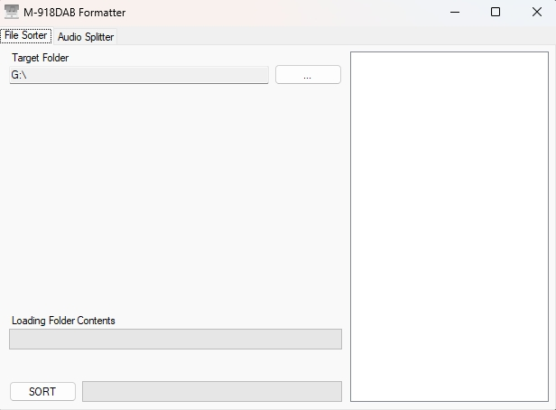
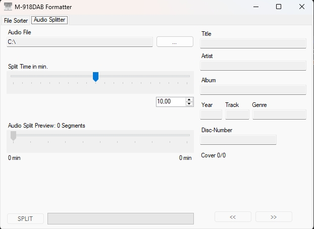

#  M-918DAB Formatter

A small Windows tool that gets USB sticks ready for the **Kenwood M-918DAB** micro hi-fi system. It fixes the order in which the unit plays your files, and it cuts long recordings like audiobooks into short tracks.

Other car stereos and hi-fis that play USB sticks in directory order should benefit too, but the M-918DAB is what it's built for. Despite the name, it never formats or wipes your drive.

<p align="center">
  
  
</p>

## Why?

**Playback order.** The M-918DAB doesn't sort the files on a USB stick by name. It plays them in the order their entries appear in the stick's FAT directory tables, and that order depends on how the files were copied and on everything you deleted or added since. A neatly numbered album can easily play as 1, 3, 2, 10, 4…

**Long recordings.** The unit can't resume or seek well inside long tracks, which makes audiobooks, podcasts and radio recordings a chore. Cut into 10-minute parts, you can pick up close to where you left off and use the track buttons to jump through the recording.

## Features

**File Sorter**

- Rewrites the directory tables of a FAT16/FAT32 drive so every folder plays in natural name order (`2 - …` before `10 - …`, like in Explorer).
- Works recursively on the whole drive, including its root folder.
- Shows the drive's contents in the order the M-918DAB sees them, before and after sorting.
- Leaves system folders alone and moves hidden files and OS clutter to the end.
- Only moves entries within the drive and never copies or rewrites file data, so it's quick even for large collections.
- Refuses drives the M-918DAB couldn't read anyway (exFAT, NTFS).

**Audio Splitter**

- Splits an audio file into parts of a fixed length, e.g. 10 minutes.
- Copies the audio instead of re-encoding it: fast and without any loss of quality.
- Numbers the parts (`01 - …`, `02 - …`) so they sort and play in the right order.
- Shows the file's tags and embedded cover art, and previews where the cuts will be.

## Requirements

- Windows with .NET Framework 4.8, which is built into Windows 10 (version 1903 and later) and Windows 11.
- A USB stick formatted as **FAT32** (or FAT16). The M-918DAB can't read exFAT or NTFS.
- [FFmpeg](https://ffmpeg.org) (`ffmpeg.exe` and `ffprobe.exe`), for the Audio Splitter only. App will prompt for it.

## Installation

1. Download the latest build from the [Releases](../../releases/latest) page.
2. Put `M918DAB-Formatter.exe` in a folder of your choice and run the exe. There's no installer; all libraries are embedded in the exe.
3. To use the Audio Splitter, install FFmpeg:

   ```powershell
   winget install Gyan.FFmpeg
   ```

   Alternatively, download a Windows build from [ffmpeg.org](https://ffmpeg.org/download.html#build-windows) and put `ffmpeg.exe` and `ffprobe.exe` in a folder on your `PATH` or next to `M918DAB-Formatter.exe`. Restart the app if it was already running.

## Usage

### Sorting a USB stick

1. Copy your music to the stick.
2. Open the **File Sorter** tab, click `...` and select the stick's root folder, e.g. `E:\`.
3. The tree on the right shows the stick's current order, which is the order the M-918DAB will play it in.
4. Click **SORT** and wait until **Success** appears. The tree then reloads with the new order.
5. Eject the stick safely and plug it into the M-918DAB.

> [!WARNING]
> Sorting moves every file and folder below the selected folder. Back up anything you can't replace before the first run, and don't unplug the drive or let the PC sleep while a sort is running. There's no cancel button, but closing the window asks first and then stops safely: everything in the folder being sorted is moved back into it before the app exits. If a sort was interrupted anyway, see [Troubleshooting](#a-sort-was-interrupted).

Entries are ordered like this:

- **Natural, case-insensitive name order**, the same as in Windows Explorer: `Track 2.mp3` comes before `Track 10.mp3`.
- **Folders and files are sorted together** by name. Folders don't come first.
- **Every subfolder** is sorted too.
- **Hidden and system entries** and OS clutter (`Thumbs.db`, `desktop.ini`, `.DS_Store`, `IndexerVolumeGuid`, `._*`) go to the end of their folder.
- **System folders** (`System Volume Information`, `$RECYCLE.BIN`, `RECYCLED`, `RECYCLER`, `FOUND.000`, `FOUND.001`, `LOST.DIR`, `.Trashes`, `.Spotlight-V100`, `.fseventsd`, `.TemporaryItems`) are skipped: they're neither moved nor sorted.

Good to know:

- **Pick the drive root** to sort everything. If you pick a subfolder, only its contents are sorted. The subfolder itself is recreated in the process and may end up at a different position among its neighbors.
- **Sort again after every change** to the stick. New files take the first free slot Windows finds, which is often not where they belong.
- **Folder dates change.** Folders are recreated, so their creation dates are reset. Files keep their timestamps.

### Splitting a long recording

1. Open the **Audio Splitter** tab. If FFmpeg is missing, the app offers to open its download page.
2. Click `...` and pick an audio file (MP3, WAV, FLAC, AAC, OGG or WMA; choose *All Files* for anything else FFmpeg can read). The panel on the right shows its tags and cover art. Use `<<` and `>>` to page through multiple covers.
3. Set the part length with the slider (1–20 minutes) or type an exact value (1–100 minutes, e.g. `7.5`).
4. The preview bar marks the cut points and shows how many parts you'll get.
5. Click **SPLIT** and wait until **Success** appears.

The parts are saved next to the original, which stays untouched:

```text
Audiobook.mp3
01 - Audiobook.mp3
02 - Audiobook.mp3
03 - Audiobook.mp3
…
```

The numbers are zero-padded to at least two digits (`001` once there are 100 parts or more). Files with the same names are overwritten. If you stop a split by closing the app, the part that was being written is left incomplete; splitting again replaces it. The parts keep the source's format, so start from a format your M-918DAB can play. For the best result, split on your PC, copy the parts to the stick, then run the File Sorter.

The app remembers the last folder you sorted and the folder of the last audio file you opened. They're stored per Windows user under `%LOCALAPPDATA%\M918DAB-Formatter\`.

## How it works

### Why the order gets scrambled

On FAT file systems, every folder is a table of 32-byte slots. A long file name takes one slot per 13 characters plus one; a short 8.3 name takes a single slot. Windows puts a new entry into the first run of free slots that's big enough, which is either the end of the table or a gap left by an entry that was deleted earlier. The M-918DAB, like many car stereos and hi-fis, simply plays the entries in table order.

### Reading the real order

`FatDirectory` opens a folder handle with `CreateFile` and lists its entries with `GetFileInformationByHandleEx(FileFullDirectoryInfo)`. On FAT volumes, the `FileIndex` Windows reports for an entry is its byte offset within the folder's table, so sorting by it gives the on-disk order. The folder tree uses this order on FAT, FAT32 and exFAT drives and falls back to the normal listing elsewhere.

### Rewriting it

`SortFileHelper` works through the folders from the deepest level up. For each folder it:

1. Plans the target order with `NaturalFileNameComparer`, which uses `StrCmpLogicalW` (the comparison Explorer uses) and breaks ties with a case-insensitive ordinal comparison.
2. Creates a hidden staging folder in the parent folder, named `.reorder_stage_` plus the folder's name.
3. Moves every entry into the staging folder in the planned order. A new folder has no gaps, so the entries land in exactly that order.
4. Deletes the now empty original folder and renames the staging folder to the original name.

Because children are handled before their parent, the parent's own pass puts each child folder into its correct position afterwards. If a folder can't be completed, for example because a file is in use, its entries are moved back out of the staging folder and the error is shown. Since a staging folder's name says which folder it belongs to, a sort that finds one left over from an interrupted run moves its entries back before it starts.

### The drive root

The root folder can't be deleted or renamed, so its entries are moved into a staging folder inside the root, `.reorder_stage_`, and back again. At that point the root's table is full of gaps left by the entries that just moved out. Under the first-fit rule, a short 8.3 name moved back later could drop into a small gap in front of a long name moved back before it.

`FatDirectoryPacker` rules that out. Before anything moves back, it fills every free slot with empty single-slot filler files (`~PAK0000.TMP`, `~PAK0001.TMP`, …). It creates them in batches of eight and stops as soon as none of a batch lands in a gap. From then on, every entry that moves back can only be appended, so the planned order holds. The fillers are deleted afterwards, which leaves free slots in front of the sorted entries that players skip. Fillers left behind by an interrupted run are removed at the start of the next root sort.

### Splitting audio

Tags, duration and cover art are read with FFprobe and FFmpeg through [FFMpegCore](https://github.com/rosenbjerg/FFMpegCore). The split uses FFmpeg's segment muxer with stream copy, roughly:

```text
ffmpeg -y -i "Audiobook.mp3" -map 0 -f segment -segment_time 600 -segment_start_number 1 -reset_timestamps 1 -c copy "%02d - Audiobook.mp3"
```

`-c copy` avoids re-encoding, `-map 0` keeps every stream (such as cover art), and `-reset_timestamps 1` lets each part start at 0:00.

## Building from source

You need Windows and **Visual Studio 2026** with the **.NET desktop development** workload. The code uses C# 14 features such as the `field` keyword, which older compilers reject.

1. Clone the repository and open `M918DAB-Formatter.slnx`.
2. Select the **Release** configuration and build. NuGet restores the dependencies automatically.
3. The app is written to `M918DAB-Formatter\bin\Release\net48\`.

To build from the command line, open a **Developer PowerShell for VS 2026** in the repository folder and run:

```powershell
msbuild M918DAB-Formatter.slnx -restore -p:Configuration=Release
```

`dotnet build` doesn't work for this project. The .NET SDK's MSBuild can't embed the window icon (a non-string resource) in a .NET Framework app and fails with `MSB3822`/`MSB3823`.

[Costura.Fody](https://github.com/Fody/Costura) embeds all NuGet dependencies into the exe at build time, so the output folder contains only `M918DAB-Formatter.exe`, its `.exe.config` and the `.pdb`.

### Tech stack

| Area | Used |
| --- | --- |
| Language | C# 14 (`LangVersion` latest, nullable reference types) |
| Framework | .NET Framework 4.8, Windows Forms |
| Audio | FFmpeg via [FFMpegCore](https://github.com/rosenbjerg/FFMpegCore) 5.4.0 |
| Packaging | [Costura.Fody](https://github.com/Fody/Costura) 6.2.0 |
| Native APIs | `CreateFile` and `GetFileInformationByHandleEx` (kernel32), `StrCmpLogicalW` (shlwapi) |

### Project structure

```text
M918DAB-Formatter.slnx               Solution
M918DAB-Formatter/
├── Program.cs                       Entry point
├── MainForm.cs                      Main window with the File Sorter and Audio Splitter tabs
├── AudioMetadataControl.cs          Read-only tag and cover art panel
├── MultiHandleTrackBar.cs           Track bar with extra read-only thumbs (split preview)
├── Data/
│   └── AudioMetadata.cs             Tags, duration and cover art via FFprobe/FFmpeg
├── Utils/
│   ├── SortFileHelper.cs            The sort: plan, stage, move back, roll back on failure
│   ├── FatDirectory.cs              Reads a folder's raw FAT entry order (Win32)
│   ├── FatDirectoryPacker.cs        Fills free root slots with filler files
│   ├── FATHelper.cs                 Lists a folder in playback order
│   ├── NaturalFileNameComparer.cs   Explorer-style natural sort
│   ├── AudioSplitterHelper.cs       Splits audio with FFmpeg's segment muxer
│   ├── FFmpegUtils.cs               Checks whether FFmpeg is installed
│   ├── LoadFileHelper.cs            Fills the folder tree
│   └── IOHelper.cs                  File and folder pickers
├── Properties/Settings.settings     Remembers the last used folders
└── Resources/                       App icon
```

## Troubleshooting

### "This drive is formatted as exFAT" or "Detected filesystem …"

The M-918DAB only reads FAT16 and FAT32, so the sorter refuses anything else. Back up the music, reformat the stick as FAT32, copy the music back and sort again. Windows' built-in formatter may only offer FAT32 for drives up to 32 GB.

### "Sorting finished, but N entries could not be moved" or "An error occurred"

Usually a file on the stick was open in another program, such as a media player, Explorer's preview pane or a virus scanner. Close it and sort again. A folder that couldn't be completed has its entries moved back where they were, but the playback order stays off until a sort finishes cleanly.

### A sort was interrupted

Closing the app during a sort is safe: it asks first, then moves the entries of the folder in progress back before it exits. If the stick was pulled, the PC went to sleep or the app was killed mid-sort, though, some entries may be stuck in a staging folder named `.reorder_stage_` followed by the name of the folder they belong to (just `.reorder_stage_` for the drive root). The next sort that covers that folder moves them back automatically before it changes anything else: sort the drive root again, or the affected folder or any folder above it.

Some staging folders can't be put back automatically: those left by older versions of the app, which end in a long ID instead of a folder name, and any holding an entry whose name is now taken by another file. A sort that finds one stops before changing anything and lists where they are. They're marked hidden and system, so in Explorer turn on *Hidden items* and, in the folder options, turn off *Hide protected operating system files*. Each one holds the contents of the folder that was being sorted when the run stopped: a folder in the same place, or the drive root. Move the items back where they belong (if their folder no longer exists, rename the staging folder to that name), delete the empty staging folder and sort again.

Empty `~PAK0000.TMP`-style files in the drive root are leftover fillers. The next sort of the drive root deletes them.

### The Audio Splitter says FFmpeg isn't installed

Install it as described under [Installation](#installation), then restart the app. `ffprobe.exe` is needed as well as `ffmpeg.exe`; without it, opening a file fails with "Failed to load audio metadata".

## Limitations

- Windows only: the sorter depends on Win32 APIs and on how the Windows FAT driver places entries.
- Sorting supports FAT16 and FAT32 drives only.
- The folder tree shows at most 10,000 entries.
- Tags are displayed, not edited.
- Sorting and splitting can only be stopped by closing the app.

## Credits

- [FFmpeg](https://ffmpeg.org) does all the audio work. It isn't bundled; you install it separately.
- [FFMpegCore](https://github.com/rosenbjerg/FFMpegCore) (MIT) wraps FFmpeg for .NET.
- [Costura.Fody](https://github.com/Fody/Costura) (MIT) packs all dependencies into the exe.

## License

Released under the [MIT License](LICENSE).

This is an independent project. It isn't affiliated with or endorsed by Kenwood or JVCKENWOOD Corporation.
